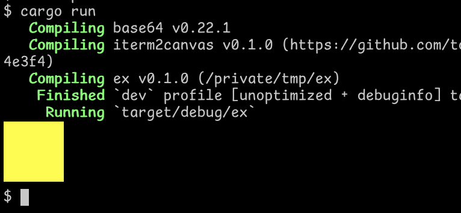

# A simple iTerm2 terminal inline picture library

Having graphics directly in the terminal, as supported by
[iTerm2](https://iterm2.com/),
[kitty](https://sw.kovidgoyal.net/kitty/) and others is very
convenient.  This minimal crate provides an easy way to create
graphics with minimal fuss (though it currently only support iTerm2).

# Example - a yellow block

Include
```
iterm2canvas = { git = "https://github.com/tommythorn/iterm2canvas" }
```
as a dependency in your `Cargo.toml` and
```
use iterm2canvas::Pict;

fn main() {
    let mut pict = Pict::new(100, 100);
    for x in 0..100 {
        for y in 0..100 {
            pict.plot(x, y, 0xFFFF00);
        }
    }
    pict.dump_iterm2_image(None);
}
```

as `main.rs` to get

